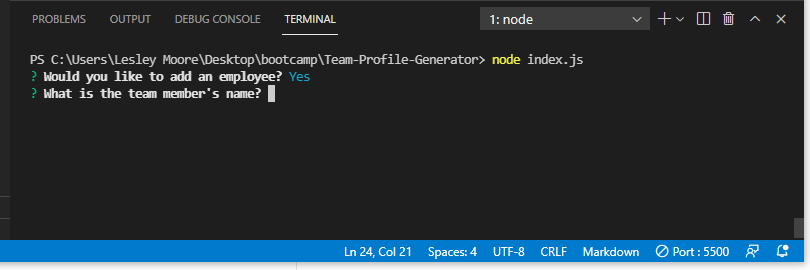

# Team-Profile-Generator

## Description 

This team building website takes the information the user inputs in the terminal using command node index.js and places that information in an html document. 

## Requirements

* HTML file is created using the team info inputted in the terminal 
* WHen the email is clicked you can send an email to them
* When GitHub is clicked you get their GitHub profile
* After adding one employee you are prompted with the option to add an intern and another employee 
* When you finish building your team the html is created
* A walkthrough video is provided

## Test

The user should test the application using their terminal and command node index.js 

## Walkthrough Video 

[Walkthrough Video](https://drive.google.com/file/d/1DpJ4VBGzpdaSa6xx_LEKqQJblppeTKpv/view)